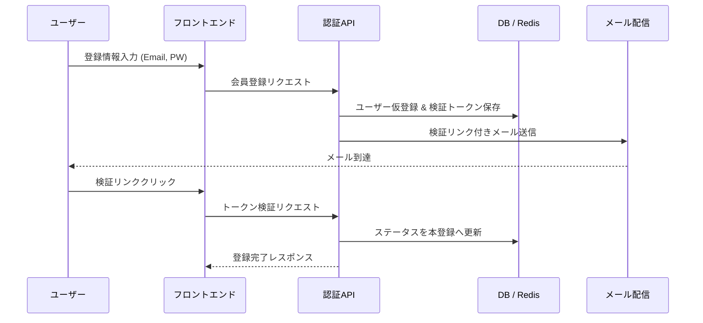

# Input Example (ユーザーの入力)

「ユーザーがメールアドレスとパスワードでサインアップ・ログインできる機能を作って。パスワードを忘れた時のリセット機能も必要。」

# Output Example (期待される出力：品質基準)

# 要件定義書: 認証基盤 (Authentication Service)

## 1. 概要 (Overview)

- **背景と課題**: 現在、サービス独自の認証基盤が存在せず、ユーザー識別ができない。セキュリティと拡張性を担保したID管理が必要である。
- **目的**: 堅牢で標準的なメール/パスワード認証を実装し、ユーザーのオンボーディングを安全に実現する。
- **ターゲット**: 全ての一般利用ユーザー（PC/MBブラウザ利用想定）。

## 2. スコープ (Scope)

- **In-Scope**:
  - 新規会員登録 (Sign up): バリデーション、メール検証、初期プロフィール作成。
  - ログイン (Sign in): セッション管理、CSRF対策、レートリミット。
  - パスワードリセット (Forgot Password): トークン発行、メール送信、再設定。
  - ログアウト: セッション破棄、Cookieクリア。
- **Out-of-Scope**:
  - ソーシャルログイン (OAuth2/OpenID Connect)
  - 多要素認証 (MFA/2FA)
  - 管理者用ユーザー管理画面 (フェーズ2)

## 3. 確認事項・不明点 (Clarifying Questions) - AIが追加確認すべき点

- [ ] ログインセッションの有効期間（デフォルトは2週間か、ブラウザを閉じると終了か）。
- [ ] パスワードリセットメールの送信元アドレス（support@example.com等）の指定。
- [ ] 同一メールアドレスを複数アカウントで共有することを許可するか（現在は許可しない方針）。

## 4. 機能要件 (Functional Requirements)

### 4.1 機能一覧 (Feature List)

- **[FR-01] 新規会員登録**: メールアドレスとパスワードによる仮登録、およびメール検証による本登録機能。
- **[FR-02] ログイン**: 登録済み認証情報によるセッション発行（Cookieベース）。
- **[FR-03] ログアウト**: 有効なセッションの破棄。
- **[FR-04] パスワードリセット**: 登録メールアドレス宛のリセットリンク送信、およびパスワードの再設定。
- **[FR-05] アカウントロック**: 連続ログイン失敗時の時限的なアクセス制限。

### 4.2 登録・認証フロー (Sequence Diagram)



### 4.2 詳細仕様 (Detailed Specs)

#### A. 新規会員登録 (Sign up)

- **入力項目**:
  - `email`: 必須。RFC 5322準拠。正規表現 `^[a-zA-Z0-9_.+-]+@[a-zA-Z0-9-]+\.[a-zA-Z0-9-.]+$` で検証。小文字に正規化して保存。
  - `password`: 必須。8文字以上128文字以内。英大文字、英小文字、数字、記号のうち3種以上を含むこと。
- **処理**:
  - 二重登録チェック: 既に登録済みの場合は `3.1.5` のセキュリティ仕様に従う。
  - ハッシュ化: **Argon2id** を使用。
  - 検証トークン: 64文字のランダム文字列。RedisにTTL 24時間で保存。

#### B. ログイン (Sign in)

- **認証方式**: ステートフルセッション (Cookieベース)。
- **Cookie属性**: `HttpOnly=true`, `Secure=true`, `SameSite=Lax`, `Path=/`, `Max-Age=1209600` (14日間)。
- **セキュリティ応答**:
  - 認証失敗時は一律 `401 Unauthorized` を返却。
  - レスポンスボディ: `{"code": "AUTH_FAILED", "message": "Invalid email or password"}`。

### 4.3 エッジケース・異常系

| ケース                 | 期待する挙動                                                                         | ステータスコード        |
| ---------------------- | ------------------------------------------------------------------------------------ | ----------------------- |
| 検証トークン期限切れ   | 「リンクの有効期限が切れています。再送してください」と表示。                         | `410 Gone`              |
| 登録済みメールで再登録 | 「確認メールを送信しました」と表示し、登録済みである旨の別テンプレートメールを送信。 | `202 Accepted`          |
| 短時間の連続アクセス   | 同一IPからのリクエストを遮断。                                                       | `429 Too Many Requests` |

## 5. 非機能要件 (Non-Functional Requirements)

### 5.1 セキュリティ (Security)

- **データ保護**: DB接続はTLS、通信はHTTPS(TLS 1.3推奨)。パスワードハッシュにはソルトを付与（Argon2は自動管理）。
- **認証ヘッダー**:
  - `X-Content-Type-Options: nosniff`
  - `X-Frame-Options: DENY`
  - `Content-Security-Policy: default-src 'self'`
- **Idempotency**: 登録リクエストにべき等性を持たせるため、クライアント側でリクエストIDを発行することを検討。

### 5.2 パフォーマンス (Performance)

- **応答速度**: 認証系のAPI（ハッシュ計算含む）のレイテンシ 95%tile を **400ms** 以内とする。
- **同時接続**: 同時サインアップリクエスト 100 req/sec を処理可能な設計とする。

### 5.3 可観測性 (Observability)

- **監査ログ (Audit Logs)**:
  - 項目: `timestamp`, `event_type`, `user_id_hash`, `ip_address_masked`, `user_agent`, `status`
  - 記録タイミング: ログイン(成・否)、パスワード変更、ロックアウト時。

## 6. データモデル (Data Model)

### Users Entity

```sql
CREATE TABLE users (
    id UUID PRIMARY KEY DEFAULT gen_random_uuid(), -- UUID v4 or v7
    email VARCHAR(254) UNIQUE NOT NULL,
    password_hash TEXT NOT NULL,
    status VARCHAR(20) NOT NULL DEFAULT 'PENDING', -- PENDING, ACTIVE, BLOCKED
    verified_at TIMESTAMPTZ,
    last_login_at TIMESTAMPTZ,
    failed_attempts INTEGER DEFAULT 0,
    lockout_until TIMESTAMPTZ,
    created_at TIMESTAMPTZ NOT NULL DEFAULT NOW(),
    updated_at TIMESTAMPTZ NOT NULL DEFAULT NOW()
);
```

## 7. 技術スタック (Tech Stack)

- **Backend Framework**: Node.js / TypeScript (NestJS)
- **ORM/DB**: Prisma / PostgreSQL 16
- **Cache/Session**: Redis (ElastiCache)
- **Email Service**: AWS SES / SendGrid

## 8. リスクと対策 (Risks & Mitigation)

- **リスト型攻撃**: アカウントロックアウト（5回連続失敗で15分ロック）および CAPTCHA の導入。
- **パスワード漏洩**: 漏洩済みパスワードデータベース（Have I Been Pwned等）との照合（登録時オプション）。
